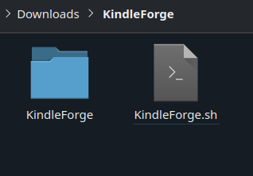

# Installing KindleForge
Yep, there's an appstore for your jailbroken Kindle, and it has everything from [KUAL](../../jailbreaking/post-jailbreak/installing-kual-mrpi), [KOReader](../koreader), an [OTA Checker](../../../support/otastatus), [Alpine Linux](../../../support/alpine), and more!

If you encounter any issues while following this guide, you should join the <a href="https://discord.gg/aSG3eMsAsW">KindleTweaks Discord Server</a> for support.

    

        <button id="prev">Previous Step</button>
        
        <button id="next">Next Step</button>
    

    

        

            <h2>Download The Latest Release</h2>
            

                
This download is provided by the <a href="https://github.com/KindleTweaks">KindleTweaks Organization</a>.

                <a href="https://github.com/KindleTweaks/KindleForge/releases/latest/download/KindleForge.zip" class="button">Download</a>
                 
            

        

            <h2>Extract the .zip File</h2>
            

                
Extract the contents of the archive you just downloaded. You should end up with a <code>KindleForge</code> folder and a <code>KindleForge.sh</code> file.

                
If you only have a <code>KindleForge</code> folder, ensure that you didn't extract the archive's contents to a folder under the archive name.

                 
                 
            

        

            <h2>Copying the Files to Your Kindle</h2>
            

                
Copy the <code>KindleForge</code> folder and <code>KindleForge.sh</code> file into your Kindle's <code>documents</code> folder.

                 
            

        

    

    

        <button id="prev">Previous Step</button>
        
        <button id="next">Next Step</button>
    

## Updating

You can check your version number by scrolling to the bottom of the KindleTweaks app.

### Versions >= 4.0.9
1. Open KindleForge.
2. Click the 3 dots at the top of your screen.
3. Click "Update KForge".
### Versions <= 4.0.8
1. Delete the `KindleForge` folder.
2. Delete the `KindleForge.sh` file.
3. Re-do the install instructions.

For any other issues, join the [KindleTweaks Discord Server](https://discord.gg/aSG3eMsAsW).

# Credits
- [MonkeyInPrivate](https://github.com/MonkeyInPrivate) - Wrote the Updating and Troubleshooting section
- [KindleTweaks Organization](https://github.com/KindleTweaks) - Created KindleForge
